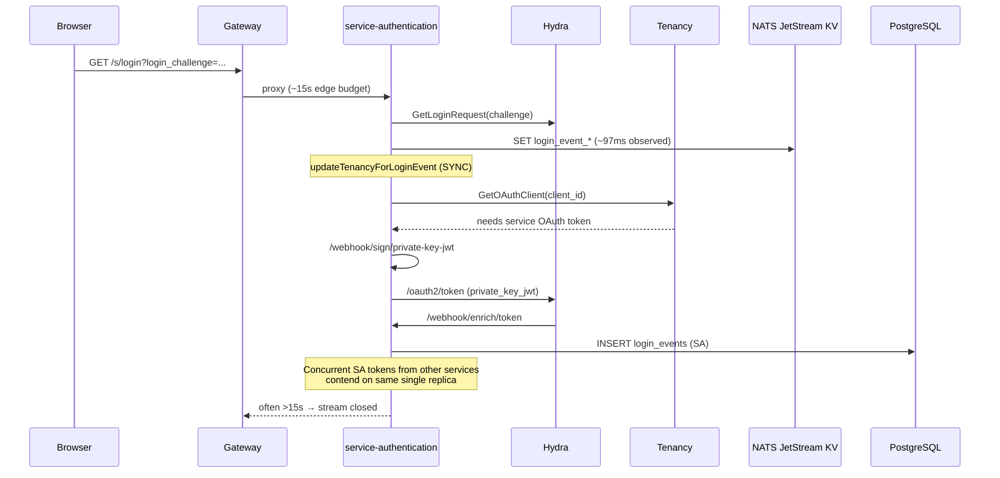
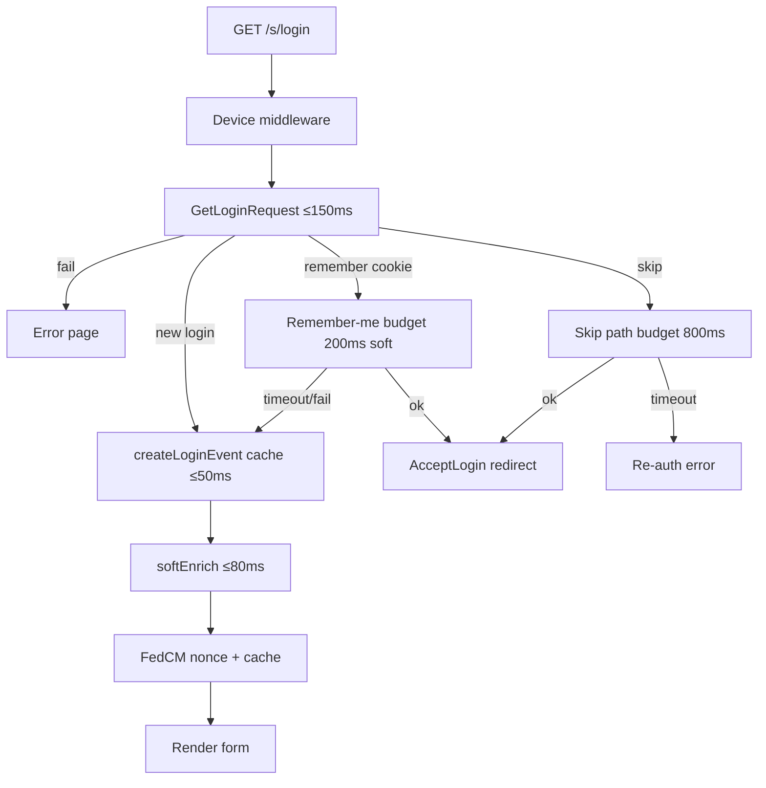
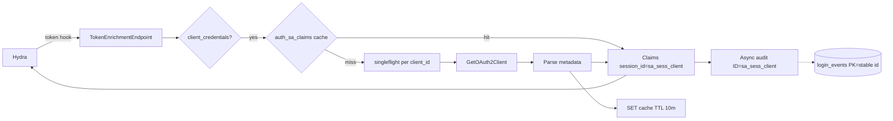

# Sub-second OAuth Login + Valkey Cache Migration

| Field | Value |
|-------|-------|
| **Document** | Sub-second OAuth Login + Valkey Cache Migration |
| **Author** | TBD |
| **Date** | 2026-07-21 |
| **Status** | Draft — implementation-ready after Key Decisions (resolved below); PR2 SA audit consumers inventory is a merge gate, not a design blocker |
| **Repo** | `service-authentication` (`apps/default`) |
| **Related deploy** | `stawi.org/deployment.manifests/namespaces/identity/` |
| **Audience** | Platform / identity senior engineers |
| **Revision** | 2026-07-21-r4 (implementation started: PR0+PR1+PR2; PR3 skipped — Frame `/healthz`) |

---

## Overview

Production users hit gateway timeouts on `GET https://accounts.stawi.org/s/login?login_challenge=...`. Live evidence for challenge prefix `kvHB-O5cHqvbMc4r` shows login-event cache create at ~97ms, then **~15s** blocked on tenancy `GetOAuthClient`, which itself needs a service OAuth token. That token path loops into the same auth pod (`/webhook/sign/private-key-jwt` → Hydra `/oauth2/token` → `/webhook/enrich/token` with a durable `login_events` INSERT), under concurrent M2M traffic from service-savings, trustage, chat-drone, and authentication itself. The request ends at `duration_ms: 14976` with `http2: stream closed` (gateway ~15s budget).

This design makes interactive login **sub-second where possible and always under gateway budget** under concurrent platform M2M load, without breaking OAuth2/OIDC, contact login, social/FedCM, multi-tenancy, remember-me, or session skip. Service-account token **issuance success** is preserved; SA `session_id` / audit durability is an **intentional, documented behavioral delta** (see Key Decision #3)—not claimed as zero-change.

**Hard SLOs (phased measurement — see §Success Criteria):**

| Path | p50 target | p95 target | Hard ceiling |
|------|------------|------------|--------------|
| `GET /s/login` form render | &lt; 200ms | &lt; 500ms | never approach ~15s edge kill |
| Verification submit (OTP complete) | &lt; 400ms | **&lt; 2s** | user-facing error if budget exceeded |
| Consent (`GET /s/consent`) | &lt; 400ms | **&lt; 3s** | user-facing error if budget exceeded; tenancy work capped as a single 1s budget (not per-RPC) |
| SA token webhook (warm cache) | &lt; 20ms | **&lt; 50ms** | Hydra hook must not hang |
| SA token webhook (cold) | — | **&lt; 200ms** | |

**Incident closure rule:** PR0 (capacity) + PR1 (soft + strong budgets) fix form TTFB and prevent gateway kills on strong paths via timeouts. **PR2 (SA O(1) enrichment) is required** before declaring the incident closed under concurrent M2M load—without it, consent/verify/tenancy still drive expensive SA INSERT-heavy token minting.

---

## Background & Motivation

### Current architecture (simplified)



### Production facts (live)

| Fact | Value |
|------|-------|
| Auth replicas | HPA `minReplicas: 1` overrides `replicaCount: 2` |
| Resources | CPU 100m/500m, mem 320Mi/640Mi |
| Logging | `LOG_LEVEL=DEBUG`, `EXPOSE_ERRORS=true` |
| Cache | `CACHE_URI=nats://identity-queue-headless...:4222` + NATS creds |
| Valkey | `valkey.datastore.svc:6379`, no auth, IPv6 dual-bind, 8Gi, redis-protocol |
| Valkey ingress | NetworkPolicy allows `environment: prod` → :6379 |
| Identity egress | **default-deny egress**; `allow-required-egress` lists DNS, same-ns, pooler:5432, vault, otel, NATS, external :443 — **no datastore:6379** |
| Probes | TCP-only on port `http` |
| Edge timeout | Observed ~15s kill; accounts HTTPRoute has no short timeout; Envoy `BackendTrafficPolicy` has no requestTimeout — likely Cloudflare/edge |
| Hydra token_hook | URL + api_key only; **no explicit hook timeout** in `service-hydra.yaml` |
| Frame HTTP client | Default timeout **30s** (`frame/v2/client`) |
| Frame valkey | `connectionTimeout = 5s` on initial Ping; **no pool-size knobs** in wrapper |
| App metrics | **None** until instrumented (`docs/platform-services-metrics-audit.md`) |

### Code path that blocks the login page

`LoginEndpointShow` (`apps/default/service/handlers/login_step_1.go`):

1. Extract `login_challenge`
2. `hydraCli.GetLoginRequest` — required
3. Session skip / remember-me branches (optional)
4. `createLoginEvent` → cache SET
5. **`updateTenancyForLoginEvent` — SYNCHRONOUS** despite godoc claiming “designed to run asynchronously” (`login_step_1.go:58–66`) and call-site comment “must complete before the user can submit their contact” (`:273–276`) — **PR1 must delete this misleading godoc** to prevent reintroducing false async assumptions
6. FedCM nonce re-cache
7. Template render

`updateTenancyForLoginEvent` → `resolvePartitionByClientID` (`tenancy_access.go`) → `getOAuthClient` (`auth_contract_client.go`) → tenancy Connect RPC authenticated with a platform service token obtained via **private_key_jwt signed by this same service**, re-entering:

- `SignPrivateKeyJWTEndpoint` (`webhook_sign.go`)
- Hydra token endpoint
- `TokenEnrichmentEndpoint` → `handleServiceAccountEnrichment` → **`ensureServiceAccountLoginEvent`** which **hard-fails token issuance** if Create fails (`webhook.go:698–701`, 403 “unable to trace service account login”) and INSERTs a new `login_events` row whose ID becomes `session_id` / `login_event_id` claims

### Why soft-form-only is insufficient

There is already a Hydra metadata fallback (`tenancyIDsFromHydraClient`), but:

1. Tenancy is still **tried first** and can hang for tens of seconds (Frame default HTTP timeout 30s).
2. Soft-fail on form render alone moves the hang to **verification submit** and **consent**, which still call `ensureLoginEventTenancyAccess` / `getOAuthClient` without budgets (`login_step_2_verification_post.go:139`, `login_step_4_consent.go:99,344`).
3. Contact submit only *logs* tenant/partition and uses service-bot context for profile work — strong tenancy is required at verify + consent.
4. Without SA O(1) enrichment (PR2), every remaining authenticated tenancy call still drives expensive SA token minting under M2M load.

### Pain points summary

| Pain | Severity | Impact |
|------|----------|--------|
| Sync tenancy on `GET /s/login` via authenticated Connect | Critical | Gateway timeouts on form |
| Same loop unbounded on verify/consent | Critical | Hang moves later in funnel |
| SA webhook INSERT per token + hard-fail on audit | High | Contends with user login; 403s on DB blip |
| Self-token loop for auth→tenancy | High | Cascading latency under M2M |
| NATS as cache + colon keys invalid for JetStream KV | High | Rate-limit Increment / FedCM exchange broken until key rename (PR2) |
| Identity egress missing Valkey | Critical for cutover | CACHE_URI flip will hang if netpol enforced |
| minReplicas=1, DEBUG logs, TCP probes | Medium | Amplifies blast radius and CPU |
| No product metrics | Medium | SLOs not operable until instrumented |

---

## Goals & Non-Goals

### Goals

1. **Sub-second login form** and **budgeted full interactive flow** under concurrent platform M2M traffic (see SLO table).
2. **Preserve functional success** of OAuth2/OIDC, contact login, social/FedCM, multi-tenancy, remember-me, session skip, consent claims, and SA **token issuance** when Hydra metadata is complete.
3. **Valkey for all cache** (`CACHE_URI`); NATS only for `EVENTS_QUEUE_URL`. Cache key shapes stay **NATS JetStream-safe** (no `:`); Valkey still fixes TTL/`Expire` semantics and multi-replica latency.
4. **SA token enrichment O(1)** after first resolve; token succeeds without waiting on durable INSERT (intentional audit delta — Key Decision #3).
5. **Bounded remote work on every hot path**: form, remember-me, skip, verify, consent, device session, cache ops, token webhook.
6. **Fail-open for login form tenancy**; strong paths fail with **clear user-facing errors** within budget (never gateway kill).
7. **Observability & deploy hardening** including identity→Valkey egress, atomic cache cutover, capacity hotfix first.
8. **Identity invariant intact:** `JWT sub === profile_id` always.

### Non-Goals

1. Splitting UI vs webhook Deployments in the first release (optional later phase).
2. Replacing Ory Hydra or changing OAuth grant types.
3. Making user roles dynamic from an external RBAC service.
4. Adding Valkey AUTH/TLS in this change (document netpol trust; separate security track).
5. Dual-write NATS+Valkey or **split-backend multi-replica canary** (forbidden).
6. Changing consent auto-approve UX or multi-step access/workspace selection semantics.
7. Fixing tenancy service performance holistically.
8. Claiming zero change to SA `session_id` uniqueness or per-token `login_events` rows.

---

## Proposed Design

### A. Latency budgets (per-branch — not one parent timeout)

**Do not wrap all of `LoginEndpointShow` in a single 450ms parent context.** Branch budgets:

| Branch / path | Overall budget | Remote call sub-budgets | On exceed |
|---------------|----------------|-------------------------|-----------|
| **Form render** (`GET /s/login` new login) | **450ms** | Hydra GetLoginRequest **150ms**; cache SET **50ms**; tenancy soft **≤80ms total** (embedded meta free / admin GetOAuth2Client **50ms** / tenancy **40ms**); FedCM re-cache **50ms** | Still render form with available tenancy |
| **Remember-me** | **200ms soft** | DB GetByID + Create + AcceptLogin | Fail open → show form |
| **Session skip** | **800ms** (distinct SLO) | DB + device + `ensureLoginEventTenancyAccess` + AcceptLogin | Clear error / force re-login; do not use form 450ms parent |
| **Contact submit** | **2s** | Profile + verification create; optional soft re-resolve tenancy **100ms** | User-facing error redirect |
| **Verification submit** | **2s** | Profile + **strong tenancy total ≤1s** (one child ctx for all tenancy Connect work) + AcceptLogin | User-facing error page (not gateway kill) |
| **Consent** | **3s overall** | GetConsent **150ms**; getOAuthClient **≤800ms**; device session **≤500ms**; ensure tenancy **≤1s total** (single child ctx wrapping entire `ensureLoginEventTenancyAccess`, not 1s per inner RPC); AcceptConsent | User-facing error; happy path after PR2 expected ≪1s |
| **Token webhook SA** | **200ms cold / 50ms warm** | Hydra admin only on miss; **no blocking DB** | 403 only if claims incomplete |
| **Token webhook user** | **200ms** | Pass-through preferred; DB reconstruct if needed | Existing 403 paths |

Form-render step table (happy path, metadata present):

| Step | Budget p95 | Notes |
|------|------------|-------|
| Device middleware cookie decode | ≤ 5ms | Device log already async (5s bg) |
| Hydra `GetLoginRequest` | ≤ 80ms (hard 150ms) | In-cluster admin |
| `createLoginEvent` cache SET | ≤ 20ms on Valkey | Fail hard if cache write fails |
| Soft tenancy | ≤ 5ms if embedded meta; else ≤ 50ms admin | See B.1 |
| FedCM nonce + re-cache | ≤ 15ms | |
| Template + i18n | ≤ 30ms | |
| **Total form** | **p50 &lt; 200ms / p95 &lt; 500ms** | Excludes queueing under CPU throttle — capacity PR0 is prerequisite |

```go
const (
    loginFormBudget           = 450 * time.Millisecond
    loginHydraTimeout         = 150 * time.Millisecond
    loginSoftTenancyBudget    = 80 * time.Millisecond
    loginHydraAdminTimeout    = 50 * time.Millisecond
    loginTenancySoftTimeout   = 40 * time.Millisecond
    loginCacheTimeout         = 50 * time.Millisecond
    rememberMeSoftBudget      = 200 * time.Millisecond
    skipLoginBudget           = 800 * time.Millisecond
    verifyStrongBudget        = 2 * time.Second
    consentStrongBudget       = 3 * time.Second // parent; children must not sum > parent
    consentHydraTimeout       = 150 * time.Millisecond
    consentOAuthClientTimeout = 800 * time.Millisecond
    consentDeviceTimeout      = 500 * time.Millisecond
    // Single budget for the entire ensureLoginEventTenancyAccess call tree
    // (getOAuthClient + getPartition + access create/list — NOT 1s per RPC).
    strongTenancyTotalTimeout = 1 * time.Second
    saWebhookColdBudget       = 200 * time.Millisecond
    saClaimsCacheTTL          = 10 * time.Minute
    oauthClientTenancyTTL     = 15 * time.Minute
    saNegativeCacheTTL        = 2 * time.Second
    saAuditAsyncTimeout       = 2 * time.Second
    saAuditMaxInFlight        = 64 // semaphore; drop+metric when full
)
```



### B. Hot-path redesign (functionality-preserving for interactive login)

#### B.1 Tenancy resolution for form render (metadata optimization, reliable primary)

**Resolution order for soft enrich** (form only):

1. **Embedded client on `OAuth2LoginRequest`** — `loginReq.GetClient().GetMetadata()` keys `tenant_id`, `partition_id` if present. **Free optimization only** — not assumed complete for this Hydra version (runtime population unvalidated; Open Question #1 closed as **treat as best-effort**).
2. **In-process / Valkey map** `auth_oauth_client_tenancy_{client_id}` when available (PR6; optional on PR1 via in-memory only).
3. **Hydra admin `GetOAuth2Client` with 50ms timeout** — **reliable primary when metadata empty** (matches today’s fallback path, but first after free sources, not after hanging tenancy).
4. **Tenancy `GetOAuthClient` / partition resolve with 40ms timeout** — best-effort only on form path; never block past soft budget.

Emit metric/log field `tenancy_source` ∈ `login_request_meta | valkey_map | hydra_admin | tenancy | none` from day one of PR1 (log field until PR4 metrics).

**PR1 does not require Valkey client map.** Soft enrich works with (1)+(3)+(4) only. Valkey map is PR6.

```go
// softEnrichLoginEventTenancy never fails the login page.
func (h *AuthServer) softEnrichLoginEventTenancy(
    ctx context.Context,
    loginEvt *models.LoginEvent,
    loginReq *client.OAuth2LoginRequest,
) {
    budgetCtx, cancel := context.WithTimeout(ctx, loginSoftTenancyBudget)
    defer cancel()

    if tid, pid, ok := tenancyFromOAuth2Client(loginReq.GetClient()); ok {
        applyTenancy(loginEvt, tid, pid, "login_request_meta")
        _ = h.setLoginEventToCache(budgetCtx, loginEvt)
        return
    }
    // optional: in-memory / valkey map when present
    adminCtx, c1 := context.WithTimeout(budgetCtx, loginHydraAdminTimeout)
    defer c1()
    if tid, pid, err := h.tenancyIDsFromHydraClient(adminCtx, loginEvt.ClientID); err == nil {
        applyTenancy(loginEvt, tid, pid, "hydra_admin")
        _ = h.setLoginEventToCache(budgetCtx, loginEvt)
        return
    }
    tenCtx, c2 := context.WithTimeout(budgetCtx, loginTenancySoftTimeout)
    defer c2()
    if part, err := h.resolvePartitionByClientID(tenCtx, loginEvt.ClientID); err == nil && part != nil {
        applyTenancy(loginEvt, part.GetTenantId(), part.GetId(), "tenancy")
        _ = h.setLoginEventToCache(budgetCtx, loginEvt)
    }
    // else leave empty — form still renders
}
```

#### B.2 Fail-open vs strong-path semantics

| Stage | Tenancy | Behaviour on timeout / failure |
|-------|---------|--------------------------------|
| `GET /s/login` form | Soft | **Render form** |
| Remember-me | Soft 200ms | Show form |
| Session skip | Strong-ish 800ms | Error / re-login — do not hang |
| Contact submit | Soft re-resolve 100ms | Proceed with service-bot profile path; log `login_tenancy_missing_on_submit` |
| **Verification submit** | **Strong, total path ≤2s** | Clear error template/redirect; **never** wait on Frame 30s default |
| **Consent** | **Strong, total path ≤3s** | Clear error; same |
| Social callback access binding | Strong + budgets | Existing error surfaces with timeouts |
| SA token webhook | Claims required; audit async | Token OK without durable row (Key Decision #3) |

#### B.3 Strong-path budgets (verify + consent) — first-class

These are **as important as form soft tenancy** for eliminating the incident class.

**Verification submit** (`login_step_2_verification_post.go`):

```go
ctx, cancel := context.WithTimeout(req.Context(), verifyStrongBudget)
defer cancel()
// ... OTP validation ...
// One child context for the entire ensure* call tree (multiple Connect RPCs share 1s).
tenCtx, tenCancel := context.WithTimeout(ctx, strongTenancyTotalTimeout)
defer tenCancel()
loginEvent, err = h.ensureLoginEventTenancyAccess(tenCtx, loginEvent, loginEvent.ClientID, profileID)
if err != nil {
    // user-facing: "We could not complete sign-in. Please try again."
    // metric: auth.verify.tenancy_timeout or failure
    return h.showVerificationPage(..., friendlyError)
}
```

**Consent** (`login_step_4_consent.go`):

- Wrap handler body in `consentStrongBudget` (**3s** parent).
- Sub-budgets must fit under the parent (do not stack independent 1s caps per RPC):
  - `GetConsentRequest` ≤150ms
  - `getOAuthClient` ≤800ms
  - `processDeviceSession` ≤500ms (fail-open empty device_id)
  - **entire** `ensureLoginEventTenancyAccess` ≤1s total (single child ctx)
- Prefer cached oauth client tenancy (in-memory PR1; Valkey PR6) before Connect.
- On budget exceed: HTTP 503/error page with correlation id — **not** stream closed after 15s.
- **Happy-path p95 after PR2** (cheap SA mint + warm caches): expected ≪1s; 3s is fail-fast headroom under mild load, not the target.

**Warm service token (supports strong paths):** PR2 makes minting O(1); additionally, process-level token reuse (Frame OIDC token source) should already cache tokens—verify it is not re-minting every Connect call. Pre-warm SA claims for self at startup.

#### B.4 What still requires strong tenancy (preserved)

| Step | Function | Why strong |
|------|----------|------------|
| Verification complete | `ensureLoginEventTenancyAccess` | access_id + partition binding for tokens |
| Consent user claims | `buildUserTokenClaims` | Complete tenancy pair + access_id |
| Consent SA claims | `buildServiceAccountConsentClaims` | SA token claims |
| Access / workspace | `access_instructions.go` | Multi-partition selection |

#### B.5 Device session on consent (bounded)

`buildUserTokenClaims` calls `processDeviceSession` (devices service, cross-namespace). Today if `deviceObj == nil` and error → hard fail consent.

**Design:** wrap `processDeviceSession` in `consentDeviceTimeout` (500ms). On timeout/error:

- If product can accept empty `device_id` for token claims → **fail-open** with warning log + metric `auth.consent.device_timeout` (preferred for gateway safety; device_id becomes empty string in claims).
- If device_id is product-required → fail consent within 500ms with clear error (still better than unbounded hang).

**Decision for this design:** fail-open to empty `device_id` when device service times out, and set claims `device_id: ""`. User tokens remain issuable; device tracking may miss one session. Document as intentional resilience trade-off (Risk: medium audit gap).

#### B.6 LoginEndpointShow structure after change

```go
func (h *AuthServer) LoginEndpointShow(rw http.ResponseWriter, req *http.Request) error {
    // NO single parent timeout for all branches
    hydraCtx, cancel := context.WithTimeout(req.Context(), loginHydraTimeout)
    defer cancel()
    getLogReq, err := hydraCli.GetLoginRequest(hydraCtx, loginChallenge)
    // ...
    if getLogReq.Skip {
        skipCtx, c := context.WithTimeout(req.Context(), skipLoginBudget)
        defer c()
        return h.handleSkipLogin(skipCtx, ...)
    }
    if rememberID := h.getRememberMeLoginEventID(req); rememberID != "" {
        remCtx, c := context.WithTimeout(req.Context(), rememberMeSoftBudget)
        defer c()
        if url, err := h.attemptRememberMeLogin(remCtx, ...); err == nil {
            // redirect
        }
        // else fall through to form
    }
    formCtx, c := context.WithTimeout(req.Context(), loginFormBudget)
    defer c()
    loginEvent, err := h.createLoginEvent(formCtx, ...)
    h.softEnrichLoginEventTenancy(formCtx, loginEvent, getLogReq)
    // FedCM nonce + render
}
```

### C. Token webhook / M2M isolation

#### C.1 Problem

`ensureServiceAccountLoginEvent` today:

1. `getOrCreateLoginRecord` (DB)
2. Cold path: **INSERT** `login_events` — ID becomes claims `session_id` / `login_event_id`
3. Failure → **403** token denied
4. `recordTokenWebhookTrace` may UPDATE properties (also on hot path)

#### C.2 Key Decision #3 — SA claims O(1) + stable session_id + async audit (concrete)

**Decision (locked for implementation):**

1. **Token issuance must not wait on `login_events` INSERT.** Hydra webhook returns 200 with complete claims when Hydra client metadata is valid.
2. **`session_id` / `login_event_id` for SA tokens are stable per `client_id`:**  
   ```go
   func stableSASessionID(clientID string) string {
       return "sa_sess_" + clientID // NATS-safe charset: alnum + underscore
   }
   ```  
   Claims always set both `session_id` and `login_event_id` to this value. This is an **intentional semantic change** from unique per-mint login event IDs.
3. **Durable audit row PK MUST equal claim session_id** so claim→row correlation remains valid:
   - Async upsert sets `loginEvent.ID = stableSASessionID(clientID)` (not `util.IDString()`).
   - Implementation: `GetByID(ctx, stableID)` → if found, update `properties.token_webhook` / last_seen; if not found, `Create` with that ID.
   - Prefer repository `Create` with pre-assigned ID; on unique conflict, fall back to GetByID + Update (or `OnConflict` upsert if added). **Do not** invent a random UUID for SA audit rows.
   - Unit test requirement: when audit succeeds, `login_events.id == claims["session_id"] == stableSASessionID(clientID)`.
4. **Durable audit is fire-and-forget with detached context + concurrency bound:**
   ```go
   // After claims are ready; never block webhook response on this.
   func (h *AuthServer) ensureServiceAccountLoginEventAsync(parent context.Context, ...) {
       if !h.saAuditSem.TryAcquire(1) { // weighted semaphore, max saAuditMaxInFlight
           // metric auth.sa_audit_async_drop; return
           return
       }
       go func() {
           defer h.saAuditSem.Release(1)
           defer func(){ if r := recover(); r != nil { /* log + metric */ } }()
           // CRITICAL: do NOT use parent/req.Context() after handler returns — it cancels.
           ctx, cancel := context.WithTimeout(context.WithoutCancel(parent), saAuditAsyncTimeout)
           defer cancel()
           // GetByID(stableID) / Create with ID=stableID / Update properties
       }()
   }
   ```
   Prefer `go` + DB first; promote to NATS `EVENTS_QUEUE_URL` only if loss is observed under load. Failures → `auth.sa_audit_async_fail` only.
5. **Claims cache keys (NATS-safe, same shape on every backend):**  
   - `auth_sa_claims_{client_id}` TTL 10m  
   - `auth_sa_claims_neg_{client_id}` TTL 2s  
   **PR2 storage rule (bold):** Until `CACHE_URI` is redis/Valkey **and** cutover image is live, SA claims cache is an **in-process TTL map** (`sync.Map` / singleflight-backed). **Do not write these keys (or any cache keys with invalid NATS charset) to NATS JetStream KV.** After Valkey cutover, the same key strings may be stored in `RawCache`/Valkey. Optional helper: `func (h *AuthServer) saClaimsStore() ...` switches on `cacheDSN.IsRedis()`.
6. **Token still 403** if metadata incomplete (missing tenant/partition/profile/type)—same security bar as today for claims completeness.
7. **Consumer risk (documented):** any system that assumed **unique `session_id` per SA token mint** will see stable ids; systems that join JWT `session_id` → `login_events.id` **still work** when async audit has landed (same deterministic ID). Authorization uses `profile_id` / Keto (per `docs/IDENTITY_AND_AUTHORIZATION.md`).  
   **Merge gate for PR2:** inventory external dashboards/log queries for SA `session_id` uniqueness (runbook checklist).



#### C.3 Stampede mitigation (multi-replica)

| Layer | Mechanism |
|-------|-----------|
| In-process | `singleflight.Group` keyed by `client_id` for Hydra admin fetch |
| Negative cache | On Hydra miss/error, in-process sentinel **2s** (`auth_sa_claims_neg_*` only after Valkey) |
| Positive cache | **PR2:** in-process TTL map only. **After PR5 Valkey:** same keys in shared Valkey TTL 10m |
| Startup | Pre-warm **self** SA claims; optional config list of top client_ids |
| Multi-pod cold start | Accept Hydra load; metric `auth.sa_cache_miss{reason}`; load test simultaneous restart |
| Jitter | Optional 0–50ms jitter before miss fetch on non-singleflight path |
| Audit writers | Weighted semaphore `saAuditMaxInFlight=64`; drop + metric when full |

In-process singleflight alone is **not** enough across replicas—Valkey positive cache is the cross-pod fix (PR5 cutover). Before Valkey, PR2 still helps each pod after first miss.

#### C.4 Pre-warm authentication’s own token / claims

At start (after Hydra + cache ready), non-blocking:

1. Resolve own OAuth client id from Frame OIDC config.
2. Warm `auth_sa_claims_{self}` via Hydra admin metadata (no circular token if metadata complete).
3. Optionally force one token acquire so Frame token source is hot.

Startup must not fail if warm fails (log warn).

#### C.5 Causal chain (incident closure)

```text
Form TTFB hang     → fixed by PR1 soft tenancy (no tenancy token on form)
Strong path hang   → fixed by PR1 budgets (verify ≤2s / consent ≤3s) + PR2 cheap token mint
M2M amplifies mint → fixed by PR2 O(1) SA enrich (no INSERT on hot path)
Capacity/DEBUG     → fixed by PR0
Cache multi-replica→ fixed by PR5 Valkey atomic cutover + egress
```

**Do not mark incident closed after PR0+PR1 only** if M2M load still makes token mint + tenancy slow enough to burn strong-path budgets.

#### C.6 Optional Phase: deployment split

| Class | Routes |
|-------|--------|
| `auth-ui` | `/s/*`, FedCM, static |
| `auth-hooks` | `/webhook/*`, token facade |

After PR0–PR5 stable only.

### D. Valkey cache migration

#### D.1 Configuration cutover

```yaml
- name: CACHE_URI
  value: "redis://valkey.datastore.svc:6379"
# Remove CACHE_CREDENTIALS_FILE for cache (NATS events creds volume stays for EVENTS_QUEUE_URL)
```

`setupCache` already routes redis → `valkey.New` (`apps/default/cmd/main.go`).

#### D.2 Key namespaces, prefixes, TTLs

**Key Decision #13 (r3): All cache keys MUST be NATS JetStream-safe forever** — charset `^[-/_=\.a-zA-Z0-9]+$` (**no colon**). Use underscore separators and an `auth_` service prefix for isolation on shared Valkey. Same key strings work on memory, NATS, and Valkey → **CACHE_URI rollback to NATS remains viable** after cutover (in-flight sessions still abandoned on flip, but the image is not Valkey-key-shape-locked).

| Key pattern (canonical) | Replaces | TTL | Semantics | Fail mode |
|-------------------------|----------|-----|-----------|-----------|
| `auth_login_event_{id}` | `login_event_` | 1h | In-flight OAuth login | Create fail → hard fail start; miss → session expired |
| `auth_login_rl_{hash}_{bucket}` | `login_rl_{hash}:{bucket}` | window+1s | Rate limit | **Fail-closed** |
| `auth_fedcm_exchange_{hex}` | `fedcm:exchange:{hex}` | minutes | FedCM stash | Soft miss |
| FedCM revocation (adapter) | existing | store-defined | Disconnect | Soft miss; rename to `auth_fedcm_rev_*` if keys currently use `:` |
| `auth_oauth_client_tenancy_{client_id}` | (new) | 15m | tenant+partition | Miss → resolve |
| `auth_sa_claims_{client_id}` | (new) | 10m | SA enrichment | Miss → Hydra admin |
| `auth_sa_claims_neg_{client_id}` | (new) | 2s | Negative cache | — |

**NATS defect today (colon keys):**

- Rate limit `login_rl_{hash}:{bucket}` and FedCM `fedcm:exchange:{hex}` use **`:`** → invalid on JetStream KV → Increment/Set fail → rate limit fail-closed; FedCM stash broken.
- JetStream KV `Set` ignores TTL; `Expire` unsupported.

**Fix path (not “keep colons on Valkey”):**

1. **Code renames keys to NATS-safe underscore forms** (table above) — works on current NATS **and** future Valkey.
2. Valkey cutover then adds real TTL/`Expire` and multi-replica latency.
3. Rollback = flip `CACHE_URI` back to NATS on **same image** (keys still valid). Preferred recovery remains “previous image + previous URI” if a bad release is code-level, but key shape no longer forces Valkey-only forever.

**Code ownership for key rename (must not be deploy-only):**

| Constant / site | File |
|-----------------|------|
| `loginEventCachePrefix` | `login_step_1.go` → `auth_login_event_` |
| `rateLimitCachePrefix` + `rateLimitBucketKey` | `rate_limiter.go` → `auth_login_rl_` + `_` bucket separator |
| `fedcm:exchange:` | `fedcm_assertion.go`, `fedcm_token_exchange.go`, `fedcm_login_complete.go` → `auth_fedcm_exchange_` |
| FedCM revocation keys | `fedcm_wiring.go` / store — audit and rename if colonated |
| New SA / tenancy map keys | webhook / helpers — `auth_sa_claims_`, `auth_oauth_client_tenancy_` |

**Ship rule:** Key-shape change lands in **PR2a (or folded into PR2 for new keys + PR1 train for existing)** and **must be in the image before or with PR5 CACHE_URI flip**. Never deploy colon/`auth:` keys while pods still use NATS. Abandon in-flight login sessions once at rename (old prefixes unread)—acceptable ephemeral state.

**PR2 constraint:** SA claims/neg cache **in-process only** until Valkey; key strings still use underscore forms so a later Valkey wire-up needs no second rename.

#### D.3 Multi-replica consistency

Shared Valkey required for multi-pod login_event stickiness. **Forbidden:** mixed NATS/Valkey replicas during rollout.

#### D.4 Connection / TLS / pool / netpol

| Item | Reality | Design |
|------|---------|--------|
| Auth | none | Trust netpol only |
| TLS | none | Document residual risk |
| Frame valkey | `connectionTimeout=5s` on startup Ping; **no pool knobs** | **Do not claim ops can set dial ≤100ms or pool size** without frame upgrade. Per-request latency via **call-site `context.WithTimeout`** on Get/Set/Increment |
| Startup | Valkey down → `setupCache` fatal (same class as NATS today) | Call out crash-loop risk in rollout |
| **Egress** | Identity **missing** datastore:6379 | **Mandatory:** add to `allow-required-egress` in `namespaces/identity/common/network-policies.yaml` |
| Ingress | datastore allows prod | Already OK |
| Shared Valkey | multi-app | `auth_` prefix; confirm maxmemory-policy / headroom (8Gi PVC, 2Gi mem limit) |
| Eviction | unknown policy | If OOM eviction: rate-limit fail-closed + login session loss — monitor Valkey memory |
| Rollback | NATS-safe keys | Flip CACHE_URI → NATS on same image **supported** for emergency; sessions cold |

**Call-site cache timeouts (all hot paths):**

```go
cctx, cancel := context.WithTimeout(ctx, loginCacheTimeout)
defer cancel()
err := eventCache.Set(cctx, key, value, time.Hour)
```

#### D.5 Migration steps (atomic cutover only)

1. **PR0** capacity/logging (still on NATS).
2. Land code: soft/strong budgets (PR1), SA O(1)+**NATS-safe key renames** (PR2/PR2a), readiness (PR3), metrics (PR4).
3. Staging: image with underscore keys on NATS proves rate-limit/FedCM work **before** Valkey.
4. **PR5 single deploy change (image already has safe keys):**  
   - identity egress → datastore:6379  
   - `CACHE_URI=redis://valkey...` on **all** auth pods  
   - readiness probes  
   - **one Deployment roll** — no split-backend canary  
5. Staging full-stack Valkey validation **before** prod.
6. Optional temporary **single-replica window** only if staging unavailable—document blast radius; restore minReplicas 2 immediately after.
7. In-flight cache sessions abandoned at rename and again at URI flip (users restart login).
8. Verify rate limits (`auth_login_rl_*`), FedCM exchange, login p95, SA tokens.
9. **Rollback:** flip `CACHE_URI` back to NATS for **all** pods atomically on the **same image** (keys remain valid). For code regressions, redeploy previous image + previous URI. Egress can remain.

#### D.6 Tests

| Layer | Approach |
|-------|----------|
| Unit | In-memory cache |
| Integration | **Add** `testcontainers-go/modules/valkey` as **direct** `go.mod` require (today only indirect via go.sum / not a first-class dep). Build tag `//go:build integration` |
| Regression | Increment+Expire rate-limit on `auth_login_rl_{hash}_{bucket}`; FedCM `auth_fedcm_exchange_*`; NATS backend still accepts keys (unit or integration) |
| Load | Multi-pod cold start + concurrent login vs SA tokens |

### E. Capacity & resilience (deploy)

#### E.0 Operational hotfix first (PR0 — before code)

| Setting | Current | PR0 |
|---------|---------|-----|
| `autoscaling.minReplicas` | 1 | **2** |
| CPU request/limit | 100m/500m | **250m/1000m** |
| `LOG_LEVEL` | DEBUG | **INFO** |
| `EXPOSE_ERRORS` | true | **false** |

This reduces single-pod saturation and log CPU **without** waiting on code review. Does not fix root cause alone.

#### E.1 Later deploy (PR5) with Valkey

Also: readiness HTTP probes, CACHE_URI, egress.

#### E.2 HTTP readiness probe

New `GET /health/ready` (implement in auth — frame does **not** provide dependency checks today; probes are TCP-only):

| Check | Timeout | Notes |
|-------|---------|-------|
| DB ping or pool stats | 100ms | |
| Cache PING / trivial GET | 100–200ms | Soft-skip first 10s after start optional |
| Hydra admin health (optional) | 100ms | |

**Probe knobs:** `timeoutSeconds: 1`, `periodSeconds: 5`, `failureThreshold: 3` — avoid flap under GC with 20ms budgets (too tight).

**Liveness:** process-only (TCP or `/health/live` without deps).

**Outage semantics:** Valkey down → all pods fail readiness → complete outage for new traffic (desired for fail-closed rate limit / shared session cache). Document. Startup Valkey down → crash loop until Valkey up.

#### E.3 Gateway / edge timeouts

- Observed ~15s is **likely Cloudflare/edge**, not Envoy requestTimeout (none set on accounts route).
- **Do not raise permanent edge timeout to 30s.**
- **PR0-adjacent ops note:** temporary edge increase (e.g. 30s for 48h) is a valid **incident mitigation** while PR1/PR2 land—track as runbook action, not product design default.
- App budgets ensure completion ≪ 15s.
- Hydra token_hook: no timeout in repo values. **Set explicit hook timeout if Hydra chart supports it** (Hydra v2 `oauth2.token_hook` / client timeout — confirm against deployed Hydra version; default is often on the order of seconds). Target **≥ 2s** after SA O(1); document actual key in deploy PR. If unsupported, rely on app-side speed + Hydra defaults and monitor hook failures.

#### E.4 Circuit breaking toward tenancy (soft path only)

After 5 consecutive soft-path tenancy timeouts in 30s → open 30s circuit (metadata/admin only). Consent/verify keep hard calls with 1s RPC timeout.

### F. Observability

#### F.0 Interim measurement (before PR4 metrics)

Until app metrics exist:

| Signal | Source |
|--------|--------|
| Login duration | Structured log `duration_ms` on `LoginEndpointShow` (`login_challenge_prefix`) |
| Verify/consent duration | Add `duration_ms` logs in PR1 if missing |
| Gateway timeouts | Cloudflare 504 analytics + app logs `http2: stream closed` / client disconnect |
| OTel | Frame HTTP server latency histograms (if OTel enabled—deploy has otel on) |

Define NR/log filters in runbook:

- `message:"login page rendered" OR "login skipped"` + `duration_ms`
- Edge: status=504 host=accounts.stawi.org path=/s/login

**SLO green formal declaration requires PR4 metrics deploy.**

#### F.1 Metrics (PR4)

| Metric | Type | Labels |
|--------|------|--------|
| `auth.login_page.duration` | histogram | `outcome` |
| `auth.login_page.tenancy_source` | counter | `source` |
| `auth.verify.duration` | histogram | `result` |
| `auth.consent.duration` | histogram | `result` |
| `auth.token_webhook.duration` | histogram | `grant_type`, `path` |
| `auth.sa_cache_hit` / `miss` | counter | `reason` |
| `auth.sa_audit_async_fail` | counter | — |
| `auth.tenancy.circuit_open` | gauge | — |
| `auth.consent.device_timeout` | counter | — |

#### F.2 Alerts (after PR4)

1. Critical: login p95 &gt; 500ms for 5m  
2. Critical: verify or consent p95 &gt; 2s for 5m  
3. Critical: 5xx /s/login &gt; 1% for 5m  
4. Warning: SA cache hit &lt; 80% for 15m (post warm-up)  
5. Warning: pod count &lt; 2  
6. Warning: rate-limit deny spike  

### G. Testing & verification

- Unit: soft tenancy order; form timeout does not fail render; strong path returns error within budget; SA cache hit skips Create; claim `session_id` equals durable `login_events.id`; rate-limit underscore keys; async audit uses detached context (mock cancel of parent does not stop work).
- Integration: direct valkey module; multi-step login against one backend; NATS accepts renamed keys.
- Load: form p95 under 50 RPS SA tokens; multi-pod simultaneous cold start; verify p95 &lt; 2s; consent p95 &lt; 3s under load.
- Staging atomic Valkey cutover dress rehearsal.

### H. Compatibility matrix

| Flow | Protected by | Breakage claim |
|------|--------------|----------------|
| Contact form render | Soft tenancy + budgets | No break |
| Contact + OTP | Cache login_event; verify hard tenancy ≤2s | No break if tenancy within budget; error if not |
| Social / FedCM | Handlers + NATS-safe key rename | Restores exchange stash on NATS; Valkey improves TTL |
| Remember-me | Soft 200ms | Fail to form (already soft) |
| Session skip | 800ms budget | May error more visibly instead of hanging |
| Consent claims | Strong ≤2s + device fail-open | device_id may be empty on devices timeout |
| User token refresh | Pass-through | No break |
| SA token **issuance** | Metadata + cache | **Success path preserved** when metadata complete |
| SA `session_id` uniqueness | Stable per client | **Intentional change** — Key Decision #3 |
| SA per-token login_events row | Async upsert | **Intentional change** — may lose some audits |
| Identity sub===profile_id | Unchanged subject write | No break |
| Rate limiting | Underscore keys + Increment+Expire | Correctness fix on NATS and Valkey |
| Events/avatar | NATS EVENTS_QUEUE_URL | Untouched |

---

## API / Interface Changes

### External HTTP

No browser/OAuth client contract changes.

### Internal

| Endpoint | Change |
|----------|--------|
| `GET /health/ready` | **New** (PR3) |
| `GET /health/live` | Optional |

### Helpers (handlers)

```go
func tenancyFromOAuth2Client(c hydraclientgo.OAuth2Client) (tenantID, partitionID string, ok bool)
func (h *AuthServer) softEnrichLoginEventTenancy(...)
func (h *AuthServer) getCachedServiceAccountClaims(...)
func (h *AuthServer) setCachedServiceAccountClaims(...)
func stableSASessionID(clientID string) string // "sa_sess_" + clientID; == login_events.id
func (h *AuthServer) ensureServiceAccountLoginEventAsync(...) // detached ctx + semaphore
```

### Optional env knobs (defaults in code constants first)

| Env | Default |
|-----|---------|
| `LOGIN_FORM_TIMEOUT_MS` | 450 |
| `VERIFY_TIMEOUT_MS` | 2000 |
| `CONSENT_TIMEOUT_MS` | 2000 |
| `SA_CLAIMS_CACHE_TTL_SEC` | 600 |

---

## Data Model Changes

### PostgreSQL

No migration. SA `login_events` inserts become **async/coalesced** (behavioral).

### Cache

NATS-safe key renames (`auth_*` underscore). Atomic Valkey cutover; no dual-write.

### Hydra

No change. Relies on existing client metadata fields.

---

## Alternatives Considered

### Alternative 1: Metadata-only / never call tenancy

Rejected as sole approach — breaks access provisioning and workspace flows. Metadata-first on **form** only.

### Alternative 2: In-process token cache for auth SA only

Insufficient alone — form still waits on tenancy; SA INSERT still contending.

### Alternative 3: Split UI/hooks deployments immediately

Deferred to optional phase after software isolation.

### Alternative 4: Dual-write NATS + Valkey

Rejected — ephemeral 1h state; dual-backend multi-replica is worse.

### Alternative 5: Truly async `go updateTenancyForLoginEvent` only (smallest form TTFB hotfix)

| Pros | Cons |
|------|------|
| Tiny diff; form returns fast | Race: user submits contact before enrich finishes; godoc already wrongly claims async |
| | Does not budget verify/consent; hang moves |
| | Does not fix SA INSERT storm |

**Verdict:** Insufficient alone. May be used as emergency one-liner **only** with PR0, not as the design.

### Alternative 6: Temporary edge timeout increase (ops mitigation)

| Pros | Cons |
|------|------|
| Reduces user-visible 504 while code ships | Hides regressions if left permanent |

**Verdict:** Valid **48h incident mitigation** in runbook; not permanent architecture. Do not set product default to 30s.

### Alternative 7: Tenancy-side caching / unauthenticated metadata read for GetOAuthClient

| Pros | Cons |
|------|------|
| Helps all callers | Cross-team; longer lead time; does not remove auth-side loop if token still required |

**Verdict:** Complementary future work; not required for this design.

### Alternative 8: Hydra metadata as SoT + tenancy repair jobs

Broader platform bet; aligns with form soft path. Full SoT migration out of scope; we already use metadata for SA and soft form.

---

## Security & Privacy Considerations

| Topic | Treatment |
|-------|-----------|
| Valkey unauthenticated | Ingress netpol prod; **add identity egress**; residual risk any prod-ns pod |
| Shared Valkey multi-app | `auth_` key prefix isolation |
| Login event cache contents | Unchanged sensitivity; 1h TTL |
| Rate limit keys | SHA-256 IP hash |
| EXPOSE_ERRORS=false | PR0 |
| SA claims cache | IDs only, not secrets |
| Fail-open form tenancy | No tokens without strong path |
| Device fail-open | Empty device_id — audit gap |
| Async SA audit loss | Documented; tokens still authz via profile_id |
| Identity invariant | Unchanged |

---

## Observability

See §F. Phased: logs → metrics → alerts.

---

## Rollout Plan


1. PR0 deploy immediately.  
2. PR1+PR2 code (P2 can parallelize after PR1 interface stability; **incident not closed without PR2**).  
3. PR3 readiness before probe flip.  
4. PR4 metrics so SLOs become operable.  
5. PR5 **atomic** CACHE_URI + egress + probes on all pods; staging first.  
6. Watch 24h; rollback is atomic env flip.  
7. Optional temporary edge timeout only during PR1/PR2 if still burning 504s.

---

## Open Questions

| # | Question | Resolution in this revision |
|---|----------|----------------------------|
| 1 | Does GetOAuth2LoginRequest populate full client metadata? | **Treat as unvalidated optimization.** Reliable primary = Hydra admin GetOAuth2Client (50ms). Metric `tenancy_source` validates in prod. |
| 2 | Do compliance reports need per-token SA login_events? | **Default: no for token success path.** PR2 merge gate: inventory consumers; if compliance requires sync durability, switch to sync-with-timeout (≤50ms) + still cache claims—see Key Decision #3 fallback. |
| 3 | Stable vs unique SA session_id? | **Stable `sa_sess_{client_id}` locked; durable `login_events.id` MUST equal that value** (Key Decision #3). |
| 4 | Frame valkey pool/dial config? | **Not configurable** in frame v2.0.1 wrapper. Call-site contexts only; optional future frame PR. |
| 5 | Exact edge timeout source? | **Likely Cloudflare ~15s**; confirm in ops runbook PR note; no code dependency. |
| 6 | Frame readiness? | **Implement custom `/health/ready` in auth** (PR3). |

---

## Key Decisions

| # | Decision | Rationale |
|---|----------|-----------|
| 1 | Soft form tenancy: free login-request metadata if present; else **Hydra admin primary** with short timeout; tenancy last/best-effort | Avoid unvalidated metadata assumption; eliminate 30s tenancy hang on form |
| 2 | **Strong-path budgets first-class:** verify ≤2s; consent ≤3s overall; **tenancy ensure = single 1s total ctx** (not per-RPC) | Hang must not move to OTP/consent; sub-budgets must sum under parent |
| 3 | **SA: O(1) claims via shared Frame RawCache; stable `session_id=sa_sess_{client_id}`; durable audit via events queue (`auth.sa.login_audit`); no in-process locks/goroutine pools; token does not wait on INSERT** | Horizontally scalable; claim↔row FK via deterministic id; inventory gate on PR2 |
| 4 | `CACHE_URI` → Valkey **atomically all pods**; NATS events only | Multi-step login requires shared backend; TTL/Expire correctness |
| 5 | **No dual-write; no split-backend canary** | Prevents cross-pod session miss |
| 6 | Per-branch latency budgets, not one parent for skip/remember/form | Skip needs 800ms; form 450ms |
| 7 | **PR0 capacity/logging first**; **PR2 required for incident closure under M2M** | Ops blast radius vs full fix |
| 8 | Identity egress datastore:6379 **mandatory** before CACHE_URI flip | Netpol default-deny egress |
| 9 | Identity invariant untouched | Authorization model |
| 10 | Valkey passwordless behind netpol for this project | Platform pattern |
| 11 | Device session on consent: **fail-open empty device_id** on timeout | Prefer login completion over device hard-fail |
| 12 | Frame pool knobs: **accept limitations**; call-site timeouts | Honesty over fictional ops controls |
| 13 | **NATS-safe keys always** (`auth_*` underscore, no `:`); enables CACHE_URI rollback on same image | Shared Valkey isolation + emergency NATS flip |
| 14 | Deployment UI/hooks split optional last | Software isolation first |
| 15 | Temporary edge timeout increase is ops mitigation only | Do not bake 30s as design default |
| 16 | Key rename is a **code PR** (files in §D.2); ships before or with Valkey cutover image | Deploy-only PR5 cannot own key constants |
| 17 | SA claims use **shared RawCache** with NATS-safe `auth_sa_claims_*` keys (works on memory/NATS/Valkey); audit is **queue-backed**, never per-pod mutex/semaphore/go pools | Horizontal scale + valid key charset |

---

## Risks

| Risk | Severity | Mitigation |
|------|----------|------------|
| Strong path still slow without PR2 under M2M | High | PR2 before incident closure; verify 2s / consent 3s fail-fast |
| Stable SA session_id breaks uniqueness assumptions | Medium | Inventory gate; docs; profile_id is authz key |
| Async audit loss / cancelled context | Low–Med | Detached WithoutCancel + timeout; semaphore; metric |
| Claim session_id ≠ login_events.id | High | Deterministic ID = stableSASessionID; unit test |
| Missing egress on cutover | Critical | PR5 includes netpol; verify PING first |
| Split cache canary | Critical | Forbidden |
| Valkey eviction drops sessions / fail-closed RL | Med | Monitor memory; `auth_` prefix; sizing |
| Readiness flap / full outage on Valkey blip | Med | Tuned thresholds; accepted fail-closed |
| Startup crash if Valkey down | Med | Same as NATS; page oncall |
| Login-request metadata usually empty | Low | Admin primary path |
| Multi-pod SA stampede | Med | singleflight + Valkey + negative cache |
| Empty device_id | Low | Metric; product accept |
| CPU throttle misses p50 | Med | PR0 CPU increase prerequisite |

---

## Success Criteria / SLOs

### Measurable now (interim — logs/OTel)

| Signal | Target | How |
|--------|--------|-----|
| Log `duration_ms` form render p95 | &lt; 500ms | NR log query / Loki |
| Verify/consent `duration_ms` p95 | &lt; 2s | PR1 adds logs |
| Cloudflare/edge 504 on `/s/login` | ~0/day | CF analytics |
| Ready pods | ≥ 2 | k8s |

### Measurable after PR4 metrics

| Metric | Target |
|--------|--------|
| `auth.login_page.duration` p50/p95 | &lt; 200ms / &lt; 500ms |
| `auth.verify.duration` p95 | &lt; 2s |
| `auth.consent.duration` p95 | &lt; 3s (target happy path ≪1s after PR2) |
| `auth.token_webhook.duration` SA warm p95 | &lt; 50ms |
| SA cache hit ratio | &gt; 80% after warm-up |
| Functional matrix | 0 regressions except documented SA session/audit delta |

### Incident closed when

PR0 + PR1 + PR2 in prod **and** form p95 &lt; 500ms **and** verify p95 &lt; 2s **and** consent p95 &lt; 3s **under concurrent M2M**, with ~0 edge 504s for 24h.

---

## References

- Code: `login_step_1.go`, `login_step_1_post.go`, `login_step_2_verification_post.go`, `login_step_4_consent.go`, `auth_contract_client.go`, `tenancy_access.go`, `webhook.go`, `webhook_sign.go`, `rate_limiter.go`, `fedcm_*.go`, `cmd/main.go` `setupCache`, `config/config.go`
- Frame: `cache/valkey/valkey.go` (`connectionTimeout=5s`), client default 30s
- Docs: `IDENTITY_AND_AUTHORIZATION.md`, `TOKEN_ENRICHMENT.md`, `platform-services-metrics-audit.md`
- Deploy: `service-authentication.yaml`, `auth-routes.yaml`, `oauth2/service-hydra.yaml` token_hook, `datastore/valkey.yaml`, `datastore/network-policies.yaml`, `identity/common/network-policies.yaml`

---

## PR Plan

Each PR independently reviewable/mergeable. Ordering reflects incident response.

### PR0 — Ops capacity / logging hotfix (deploy only)

| Field | Content |
|-------|---------|
| **Title** | `deploy(auth): minReplicas=2, CPU bump, INFO logs, EXPOSE_ERRORS=false` |
| **Files** | `stawi.org/.../service-authentication.yaml` |
| **Dependencies** | None — **ship first** |
| **Description** | Reduce single-pod blast radius and DEBUG CPU. Does **not** close incident. Optional runbook: temporary edge timeout 48h. |

### PR1 — Soft form tenancy + strong-path budgets (verify/consent/device)

| Field | Content |
|-------|---------|
| **Title** | `fix(auth): soft login tenancy + strong-path timeouts` |
| **Files** | `login_step_1.go` (delete misleading async godoc), `login_step_2_verification_post.go`, `login_step_4_consent.go`, `auth_contract_client.go` helpers, `tenancy_access.go` as needed, unit tests; add `duration_ms` logs on verify/consent |
| **Dependencies** | None (PR0 recommended in prod) |
| **Description** | Metadata-best-effort then Hydra admin primary for form soft enrich; per-branch budgets; verify/consent ≤2s with user-facing errors; device session ≤500ms fail-open empty device_id; tenancy_source log field. **No Valkey map required.** Does not close M2M incident alone. |

### PR2 — SA O(1) enrichment + stable session_id + async audit + NATS-safe key renames

| Field | Content |
|-------|---------|
| **Title** | `perf(auth): O(1) SA claims; async audit; NATS-safe cache keys` |
| **Files** | `webhook.go` (enrichment, async audit); new helpers (`stableSASessionID`, detached async, semaphore); `login_step_1.go` (`loginEventCachePrefix` → `auth_login_event_`); `rate_limiter.go` (`rateLimitCachePrefix`, `rateLimitBucketKey` underscore bucket); `fedcm_assertion.go`, `fedcm_token_exchange.go`, `fedcm_login_complete.go` (`auth_fedcm_exchange_`); `fedcm_wiring.go` if revocation keys use `:`; unit tests (claim id == durable row id; rate-limit key charset); short docs note on session_id delta |
| **Dependencies** | None strictly; **pair with PR1 for incident closure**. Merge gate: consumer inventory checklist (or explicit accept risk). |
| **Description** | **SA:** In-process TTL claims cache only (bold: **do not write SA keys to NATS RawCache**). Stable `session_id=sa_sess_{client_id}`; durable `login_events.id` set to same on async upsert; detached `context.WithoutCancel` + 2s timeout + max-64 semaphore; no blocking INSERT on webhook. **Keys:** Rename all existing colon-bearing prefixes to underscore NATS-safe `auth_*` forms (table §D.2) so NATS works now and Valkey rollback later works on same image. Singleflight + negative cache. Document intentional unique-session delta. |

### PR3 — Readiness endpoint code

| Field | Content |
|-------|---------|
| **Title** | ~~`feat(auth): /health/ready dependency checks`~~ **SKIPPED** |
| **Files** | n/a |
| **Dependencies** | n/a |
| **Description** | **Not implemented.** Frame already exposes `/healthz` via `Service.HandleHealth` + `AddHealthCheck` (see `frame/v2/service_health.go`). Colony chart defaults use `httpGet.path: /healthz`. Deploy PR0 restores HTTP `/healthz` probes (replacing TCP-only). Extra custom readiness handler is redundant unless we later need strict DB/cache fail-closed readiness beyond process liveness. |

### PR4 — Metrics instrumentation

| Field | Content |
|-------|---------|
| **Title** | `feat(auth): login/verify/consent/webhook latency metrics` |
| **Files** | metrics helper, wire login/verify/consent/webhook |
| **Dependencies** | Best after PR1/PR2 for labels |
| **Description** | Makes SLOs formally operable; NR alerts. |

### PR5 — Valkey CACHE_URI + identity egress + probes (atomic)

| Field | Content |
|-------|---------|
| **Title** | `deploy(auth): Valkey cache, egress :6379, readiness probes` |
| **Files** | `service-authentication.yaml`, `identity/common/network-policies.yaml` (egress datastore:6379), optional hydra hook timeout if supported; **optional tiny code follow-up** only if PR2 left SA store behind a `IsRedis()` switch that needs enabling—prefer PR2 already uses key shapes that work on both |
| **Dependencies** | **PR2 (key rename) must be in the running image**; PR1–PR3 recommended; PR4 preferred |
| **Description** | **Atomic** env change all pods; add egress; HTTP readiness. Wire SA claims / login_event cache to Valkey RawCache (same NATS-safe keys). Forbid mixed backends. Pre-flight: redis-cli PING from identity ns. Rollback: CACHE_URI→NATS on **same image** remains supported because keys are NATS-safe. |

### PR6 — OAuth client tenancy map + circuit breaker

| Field | Content |
|-------|---------|
| **Title** | `perf(auth): auth_oauth_client_tenancy map + tenancy circuit breaker` |
| **Files** | soft/strong helpers, tests |
| **Dependencies** | PR1; PR5 for multi-replica map |
| **Description** | 15m Valkey map key `auth_oauth_client_tenancy_{client_id}`; soft-path circuit breaker. |

### PR7 — Valkey integration tests + load harness

| Field | Content |
|-------|---------|
| **Title** | `test(auth): valkey module, NATS-safe RL keys, concurrent SA vs login` |
| **Files** | go.mod require testcontainers valkey, integration tests, k6/load docs |
| **Dependencies** | PR1, PR2 |
| **Description** | Add direct module dependency. Assert underscore rate-limit keys Increment+Expire; SA durable id == claim session_id; multi-pod cold-start load. |

### PR8 (optional) — Split auth-ui vs auth-hooks

| Field | Content |
|-------|---------|
| **Title** | `deploy(auth): split UI and webhook workloads` |
| **Dependencies** | PR0–PR5 stable |
| **Description** | Hard isolation if still needed. |

---

*End of design document (r3).*
